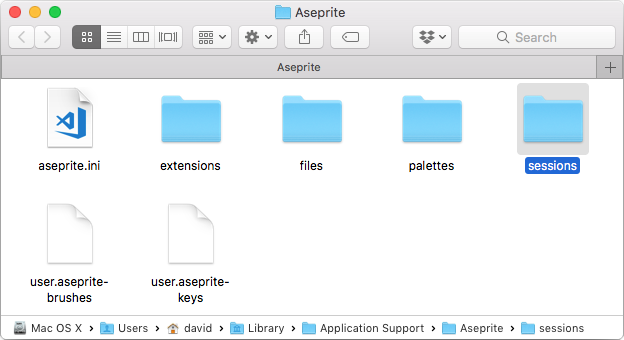

# データ復元

コンピューター（もしくは Aseprite）がクラッシュしたときにや、保存しないで閉じてしまったときにスプライトを復元できるように、Aseprite は実行中に一時的なデータを保存しています。（もしスプライトをきちんと保存したとしても、オリジナルのバックアップは少なくとも数週間ディスクに残ります。）

## 以前のセッションからスプライトを開く

以前のセッションからスプライトを復元するためには、「ホーム」タブの「リカバリーファイル」を使用します。

Aseprite がクラッシュ（正しく終了しなかった）して、スプライトが保存されていない場合は、「リカバリーファイル」がボタンとして表示されます。

このボタンは「リカバリーファイル」タブを開きます。アイテムをダブルクリック（または、選択してから「リカバリースプライト」を押す）と、以前のセッションからスプライトを復元できます。

## 設定

*編集 > 環境設定 > ファイル* の項目では、バックアップデータをどのようにどのくらいの期間保存するかを指定できます。

* *常にリカバリデータを自動保存*：編集したスプライトごとに、一定の間隔でバックアップデータをディスクに自動保存します。（デフォルトでは2分ごとです）
* *編集したスプライトデータの保持*：編集したスプライトごとに、バックアップデータを指定期間の間保持します。（デフォルトでは1週間です）
* *閉じたスプライトをメモリーに保持*：誤ってスプライトを閉じてしまったときに、（メモリ上にアンドゥ情報込みで）スプライトを少なくとも指定時間の間保持します。（デフォルトでは15分です。）閉じてしまったファイル再度開くためには、メニューから *ファイル > 最近使ったファイル > 閉じたファイルを再度開く* （<kbd>Ctrl+Shift+T</kbd> または <kbd>⇧⌘T</kbd>）を選択します。

## 内部動作

バックアップデータは[環境設定フォルダ](preferences-folder.md)の中の `sessions` という名前のフォルダに保存されます。

`sessions` はいくつかのフォルダを含んでいることがあります。（それぞれのフォルダが複数開いた Aseprite のそれぞれのウィンドウに対応しています。）

これらのフォルダ名（`20180405-165510-1128` のような）には意味があり、`YYYYMMDD-HHMMSS-PID` というフォーマットになっています。

* `YYYY`, `MM`, `DD`：セッションがスタートした（つまり Aseprite が起動した）日付。（YYYY:年、MM:月、DD:日）
* `HH`, `MM`, `SS`：セッションがスタートした時刻。（HH:時、MM:分、SS:秒）
* `PID`：セッションフォルダを扱っている Aseprite インスタンスのプロセス番号/識別子。

フォルダには失ってしまったスプライトを復元するのに有用なデータが含まれています。

「ホーム」タブの「リカバリーファイル」を使ってもセッションを復元できなかったが、[環境設定フォルダ](preferences-folder.md)に `sessions/YYYYMMDD-HHMMSS-PID` フォルダがある場合、それらのフォルダをまとめて `.zip` で圧縮して [support@aseprite.org](mailto:support@aseprite.org) まで送ってください。私たちが復元を試みます。

---

**SEE ALSO**

[トラブルシューティング](troubleshooting.md) |
[環境設定フォルダ](preferences-folder.md) |
[データ復元の内部動作についてのブログ記事](https://dev.aseprite.org/2015/06/14/data-recovery/)
