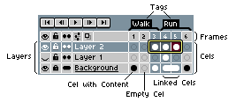

# 基础

这里你可以了解 Aseprite 的基本原理。

在 Aseprite 中，一个 [精灵](sprite.md) 由一系列帧和一组图层组成。帧和图层的交叉会创建一组可编辑的图形 [单元格](cel.md)，这些图元包含可以使用 [精灵编辑器](sprite-editor.md) 进行 [编辑](drawing.md) 的图像/像素。图层、帧和图元都可以在 [时间轴](timeline.md) 中看到：

## 精灵的基本元素

帧是精灵中的单张静止图像。添加和修改帧会创建一系列图像，这些图像序列被称为
[动画](animation.md)。Aseprite 如何循环播放帧的详细信息在 [动画部分](animation.md) 中有更详细的描述。帧在时间轴中从左到右水平排列。

每一帧的图像都是由一个或多个 [图层](layers.md) 堆叠生成的，这些图层在时间轴中按从下到上的顺序排列。时间轴最底部的图层会最先绘制，后续的每个图层都会绘制在它的上方。图层可以帮助你将一幅复杂的图像拆分为多个独立的图形组件。

每一帧与图层的交叉点称为 [单元格](cel.md)。任何特定单元格的内容都可以移动、编辑和删除，而不会影响其他单元格的内容，这使得它们非常适合在保留不变部分的同时分离和编辑图形中的特定元素。

## 工作流

基础的 [工作流](workflow.md) 如下：

* 从 *文件 > 新建* 菜单 [创建新精灵](new-sprite.md)。
* 使用铅笔工具  进行 [绘制](drawing.md) 可使用
  <kbd>左键点击</kbd> 或 <kbd>右键点击</kbd>，并使用相同的按钮从 [颜色栏](color-bar.md) 中选取颜色。
* 从 *文件 > 保存* 菜单中选择 [保存你的工作](save.md) 为 `.aseprite` 文件，以保留所有图像信息（图层、帧等。还会存储某些 [工作区](workspace.md) 首选项）。
* [导出你的精灵](exporting.md) 为 `.gif` 文件，以便在网站上发布你的图像；或导出为带编号的单独 `.png` 文件序列（每帧一个文件）；或导出为所有帧排列在单行或单列中的单个 `.png` 文件；亦或是导出为二维 [精灵表](sprite-sheet.md)。

查看 [工作区](workspace.md) 以了解有关窗口元素的更多信息。查看 [工作流](workflow.md) 部分以获取更多详细信息。

## 把手放在键盘上

你应该将左手放在键盘上 *（如果你是左撇子，则用右手）*。由于有一些实用的键盘快捷键，你可以从一开始就使用它们，以便更好地使用 Aseprite：

* 按键 <kbd>1</kbd>、<kbd>2</kbd>、<kbd>3</kbd>、<kbd>4</kbd>、
  <kbd>5</kbd> 和 <kbd>6</kbd> 可用于更改 [缩放](zoom.md)（你也可以使用鼠标滚轮来更改缩放比例）。
* 按 <kbd>B</kbd> 键可选择铅笔工具，按 <kbd>M</kbd> 键可选择矩形选框工具，这可能是你最常用的工具。
* 按住 <kbd>Alt</kbd> 键并点击鼠标可使用吸管工具  从当前活动图像中选取颜色：
  按住 <kbd>Alt</kbd> 键并左键点击可采样前景色，
  按住 <kbd>Alt</kbd> 键并右键点击可采样背景色。
* 按下 <kbd>Ctrl</kbd> 键（在 macOS 上为 <kbd>⌘</kbd>）可选择 [移动工具](move-tool.md) 。
  使用该工具，你可以轻松选择或移动图层。
* 按 <kbd>Tab</kbd> 键可隐藏或显示
  [时间轴](timeline.md)。如果你的时间轴不见了，这是快速显示它的方法！

* 按住 <kbd>空格键</kbd> 并使用 <kbd>左键点击</kbd> 进行拖动，
  可以平移当前正在编辑的精灵视图。当你处理大型图形或放大视图时，此功能非常有用。

## 右键的替代功能

默认情况下，<kbd>右键点击</kbd> 使用 [背景色](color-bar.md#背景色) 进行绘制，
但你可以从 [*编辑 > 首选项 > 编辑器*](right-click.md) 更改此配置。

---

**参阅**

[工作区](workspace.md) |
[工作流](workflow.md) |
[精灵](sprite.md)
