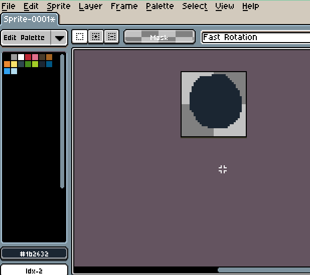
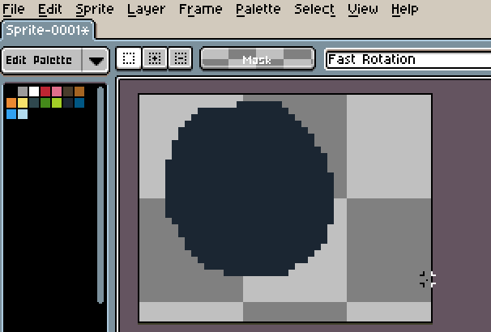
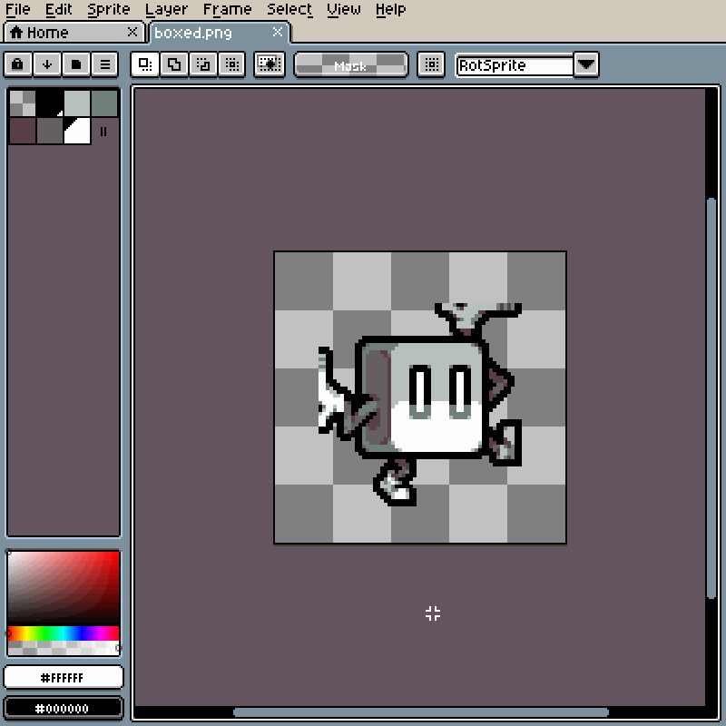

# 画布尺寸

画布是精灵的可见区域。你可以使用 *精灵 > 画布尺寸...* 菜单来更改画布大小。

> 注意：调整画布大小会相应地更新所有切片，并更改它们的位置。

在这个窗口中，你可以手动更改 `宽度` 或 `高度`，也可以使用编辑器窗口中的蓝色标尺进行更改。

## 裁剪

你可以使用当前选择边界更改画布大小：

## 修剪

你可以使用 *精灵 > 修剪* 菜单自动从画布中移除透明边框。

