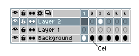
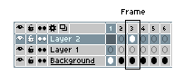
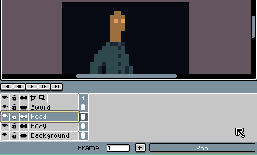
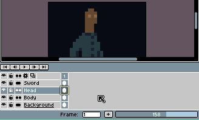

# 单元格

一个单元格（源自 [赛璐珞](http://en.wikipedia.org/wiki/Cel)）是特定帧和图层中的一幅图像，位于画布上特定的 *xy* 坐标处。

帧（frame）和单元格（cel）的区别在于，帧是特定时刻所有图层上的单元格集合：

## 移动单元格

你可以使用 [移动工具](move-tool.md) 在画布上拖放当前单元格。或者，你可以使用 [时间轴移动单元格](move-cels.md) 到其他图层/帧位置。

## 修改不透明度

在 [RGB](color-mode.md#rgb) 图像中，每个单元格都有自己的不透明度级别。你可以使用状态栏上的滑块来修改其不透明度：

你也可以右键单击单元格并选择 *属性* 选项（或通过 *帧 > 单元格属性* 菜单）来执行相同操作：

----

**参阅**

[链接单元格](linked-cels.md) |
[时间轴](timeline.md)
