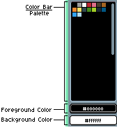
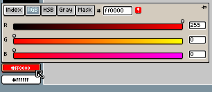
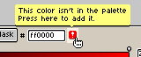

# 颜色栏

颜色栏显示当前活动精灵的调色板：

每个颜色都可以通过其索引进行标识，从 0 到 255。

使用 <kbd>左键单击</kbd> 可以选择前景色，使用 <kbd>右键单击</kbd> 可以选择背景色。使用 <kbd>X</kbd> 键可以交换这两种颜色。

根据活动精灵的[颜色模式](color-mode.md)：

* 在索引图像中，颜色栏会显示精灵中可使用的所有可用颜色。除非使用 `编辑调色板` 按钮或 <kbd>F4</kbd> 键修改调色板本身，否则无法使用调色板中不存在的颜色。

* 在 RGB 图像中，颜色栏会显示一个可供选择的调色板，但精灵并不依赖于该调色板，你可以修改调色板，而精灵的外观不会改变。这意味着你可以在精灵中自由使用调色板中不存在的颜色。

## 前景色

用于使用 <kbd>左键单击</kbd> 进行绘制的颜色。点击该按钮后，你将看到一个弹出窗口，可使用
[RGB](http://en.wikipedia.org/wiki/RGB_color_model) 或
[HSB](http://en.wikipedia.org/wiki/HSL_and_HSV) 滑块来选择颜色：

小警告图标  可用于在颜色不在调色板中时，点击将该颜色添加到调色板：

## 背景色

使用 <kbd>右键单击</kbd> 进行绘制时所用的颜色。

在以下几种情况下，该颜色还可用于清除 `背景` 图层：

* 当选区被清除时（*编辑 > 清除* 菜单），或者
* 当添加新的空白帧时（*帧 > 新建空白帧* 菜单）
* 当透明图层转换为背景图层时（*图层 > 从图层新建背景* 菜单）

---

**参阅**

[色彩](color.md)
