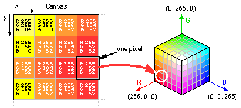
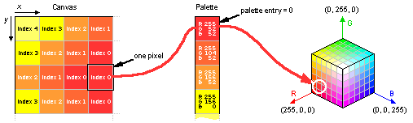
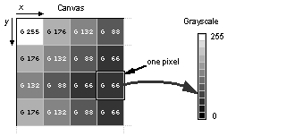

# 颜色模式

Aseprite 支持三种不同的颜色模式：

* RGB
* 索引
* 灰度

当你创建一个[新精灵](new-sprite.md)时，你必须选择其中一种颜色模式。在本节中，你将了解每种模式的详细信息。

## RGB

RGB 或 RGBA 是 Red（红）-Green（绿）-Blue（蓝）-Alpha（透明度）的缩写。每个图像像素
都包含这四个分量。这意味着每个像素都完全独立于其他像素。

Alpha 分量指定颜色的不透明度：
`Alpha = 255` 表示完全不透明，而 `Alpha = 0` 表示完全透明。

特别说明：背景图层没有 Alpha 分量，因此它始终是不透明的。

## 索引

在这种模式下，每个像素都有一个指向调色板中某种颜色的编号。你的调色板最多可以包含 256 种颜色，每个像素都指向其中一种颜色（编号从 0 到 255）。

与 RGBA 不同的是，如果你修改调色板中的颜色，所有引用该颜色的像素外观都会发生改变。

在索引图像中，一个重要的概念是：对于透明图层，我们需要一个特殊的索引来作为透明颜色。
通常这个索引是 0，但你可以从 *精灵 > 属性* 菜单中更改它。

## 灰度

它更类似于 RGBA，只是它有两个通道：明度（Value）和透明度（Alpha）。
这里 0 表示黑色，255 表示白色。透明度通道的行为与 RGBA 模式完全相同。

---

**参阅**

[颜色](color.md) |
[新建精灵](new-sprite.md)
