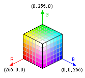
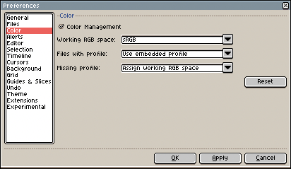

# 颜色配置文件

我们可以将屏幕上的一个像素看作一个带有三个特定 RGB 值的小矩形，每个值可以视为 0.0 到 1.0 之间的数字（或 0 到 255 之间的整数）。它表示三维空间中的一个位置，其中每个值代表每个轴（红、绿、蓝）上的一个位置：

但这个三维立方体中的一个位置意味着什么呢？我们知道
*RGB=(0, 0, 0)* 代表黑色，
*RGB=(255, 0, 0)* 代表红色，*RGB=(255, 255, 255)*
代表白色，等等。但究竟什么是[白点](https://en.wikipedia.org/wiki/White_point)呢？
当你的显示器进行校准时，使用的环境光是怎样的，以至于制造商可以说 *“好了，这就是白色”* 呢？

每个需要处理颜色的设备（显示器、打印机、相机、扫描仪等）都必须进行校准，以便将环境光转换为图片中特定的 RGB 值，反之亦然，即将这个立方体中的某些 RGB 值转换为[光波](https://en.wikipedia.org/wiki/Light)。

颜色配置文件指明了这些 RGB 值所处的[色彩空间](https://en.wikipedia.org/wiki/Color_space)。纯红色、纯蓝色、纯绿色或纯白色意味着什么呢？
它用于将一个设备（例如你创建图像时使用的显示器）中的 RGB 值与其他设备（例如观看你图像的用户的显示器）中的 RGB 值进行匹配。

互联网上的图像通常使用
[sRGB 色彩空间](https://en.wikipedia.org/wiki/SRGB)，
但 [PNG 文件](https://en.wikipedia.org/wiki/Portable_Network_Graphics) 和
[JPEG 文件](https://en.wikipedia.org/wiki/JPEG) 可以嵌入
特定的 [ICC 颜色配置文件](https://en.wikipedia.org/wiki/ICC_profile)，
其中包含其 [RGB 色域](https://en.wikipedia.org/wiki/Gamut)
和 [伽马校正](https://en.wikipedia.org/wiki/Gamma_correction)。
自 Aseprite v1.2.10-beta2 起，你也可以在
[`.aseprite` 文件中保存颜色配置文件](https://github.com/aseprite/aseprite/blob/master/docs/ase-file-specs.md#color-profile-chunk-0x2007)。

你可以从 [精灵属性](sprite-properties.md) 中分配或转换当前精灵的颜色配置文件。并且你可以从 *编辑 > 首选项 > 色彩* 中配置 Aseprite 如何管理颜色配置文件：

---

**参阅**

[色彩](color.md) |
[精灵属性](sprite-properties.md)
