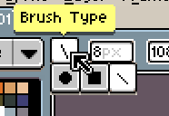
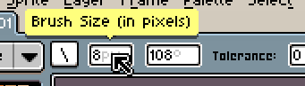
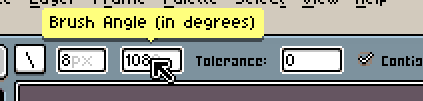
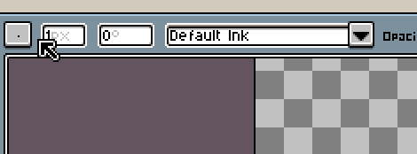

# 上下文栏

(*开发中*)

上下文栏会显示当前激活工具的特定选项。它还会根据当前激活文档的状态发生变化，例如当我们移动选区时。

## 类铅笔工具

这是铅笔工具的上下文栏：

第一个元素是笔刷类型/形状：

笔刷尺寸（以像素为单位）：

以及笔刷角度：

它对线条笔刷类型很有用：

## 选框工具

## 移动选框工具

(*开发中*)

## 吸管工具

(*开发中*)

## 油漆桶工具

(*开发中*)

