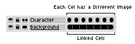

# 连续图层

连续图标  指示你在复制单元格时要使用的单元格类型。
它修改了某些命令的行为，比如
[新建帧](new-frame.md)、
[复制帧](copy-frames.md) 或 [复制单元格](copy-cels.md)。

存在两种可能的状态：

1.  此图层为普通图层（包含不连续的单元格）：新单元格将以未链接的方式创建（单元格会被复制）。
1.  此图层为连续图层：新单元格将以[链接方式](linked-cels.md)创建。

通常，对于[背景图层](layers.md#background-layer)（包含静态内容），你会倾向于使用连续单元格，
而对于每一帧都有不同单元格的图层，则会使用不连续模式：

此选项可以根据你当前处理的具体情况进行切换。修改此选项不会改变当前的单元格，因此它仅会影响后续操作。

---

**参阅**

[链接单元格](linked-cels.md) |
[图层](layers.md) |
[新建帧](new-frame.md) |
[复制帧](copy-frames.md) |
[时间轴](timeline.md)
