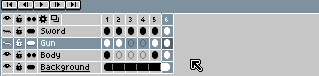

# 复制单元格

使用[时间轴](timeline.md)复制单元格：

1. 选择你想要复制的一系列单元格。
2. 将鼠标移动到选区边框。
3. 按住 <kbd>Ctrl</kbd> 或 <kbd>Alt</kbd> 键并开始拖动。
4. 按住 <kbd>Ctrl</kbd> 或 <kbd>Alt</kbd> 键，将复制内容放置到你想要的位置。

请注意，你可以将单元格复制到动画结尾之后。在这种情况下，系统会自动创建新的空白帧。

在[连续图层](continuous-layers.md)上复制单元格时，复制的单元格将与原始单元格[链接](linked-cels.md)。

---

**参阅**

[移动单元格](move-cels.md) |
[复制帧](copy-frames.md) |
[时间轴](timeline.md)
