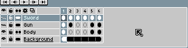

# 复制帧

使用[时间轴](timeline.md)复制帧：

1. 选择你想要复制的一系列帧。
2. 将鼠标移动到选择区域的边界。
3. 按住 <kbd>Ctrl</kbd> 或 <kbd>Alt</kbd> 键并开始拖动。
4. 按住 <kbd>Ctrl</kbd> 或 <kbd>Alt</kbd> 键，在你想要的位置释放复制内容。

请注意，你可以将帧复制到动画结尾之后，从而扩展动画。

在[连续图层](continuous-layers.md)上复制帧时，复制的单元格将与原始单元格[链接](linked-cels.md)。

---

**参阅**

[移动帧](move-frames.md) |
[复制单元格](copy-cels.md) |
[时间轴](timeline.md)
