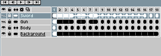

# 复制图层

使用[时间轴](timeline.md)复制图层：

1. 选择你想要复制的一系列图层。
2. 将鼠标移动到选区边界。
3. 按住 <kbd>Ctrl</kbd> 或 <kbd>Alt</kbd> 键并开始拖动。
4. 按住 <kbd>Ctrl</kbd> 或 <kbd>Alt</kbd> 键，将复制的内容放置到你想要的位置。

---

**参阅**

[移动图层](move-layers.md) |
[时间轴](timeline.md)
