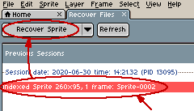
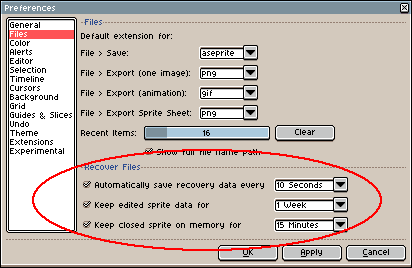
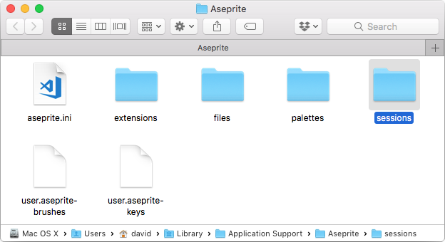
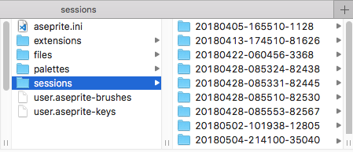

# 数据恢复

在 Aseprite 运行时，它会保存一些临时数据，以便在你的计算机（或 Aseprite）崩溃，或者你未保存精灵就关闭 Aseprite 的情况下恢复你的精灵。（即使你保存了精灵，原始备份也会在你的磁盘上至少保留几周。）

## 打开上一会话中的精灵

要从之前的会话中恢复精灵，你需要使用“主页”选项卡中的“恢复文件”选项：

如果 Aseprite 崩溃（未正确关闭）且某些精灵未保存，你将看到“恢复文件”选项以按钮形式显示：

此选项会打开“恢复文件”选项卡，在该选项卡中，你可以双击某个项目（或选中它并按下“恢复精灵”）来从之前的会话中恢复精灵：

## 首选项

在 *编辑 > 首选项 > 文件* 部分，你可以配置备份数据的保存方式以及保存时长：

* *每 X 秒/分钟自动保存恢复数据*:
  表示 Aseprite 应该为每个正在编辑的精灵每 X 秒或分钟自动保存一次备份数据（存储在磁盘上）（默认每 2 分钟一次）。
* *将已编辑的精灵数据保留 Y 天/周/月*：对于每个已编辑的精灵，Aseprite 会将备份数据（保存在磁盘上）保留指定的天数/周数/月数（默认保留 1 周）。
* *将已关闭的精灵在内存中保留 Z 秒/分钟/小时*：如果你误关闭了一个精灵，Aseprite 会将该精灵（连带撤销信息一起）在内存中至少保留指定的时间（默认 15 分钟）。你可以通过 *文件 > 打开最近文件 > 重新打开已关闭文件* 菜单选项（键盘快捷键 Ctrl+Shift+T 或 ⇧⌘T）重新打开已关闭的文件。

## 内部机制

备份数据保存在 [首选项文件夹](preferences-folder.md) 内名为 `sessions` 的子文件夹中：

`sessions` 文件夹可能包含多个子文件夹（每个 Aseprite 运行实例对应一个）：

这些文件夹的名称（例如 `20180405-165510-1128`）是有含义的，
其格式为 `YYYYMMDD-HHMMSS-PID`：

* `YYYY`, `MM`, `DD`：会话开始的日期（年、月、日）（即 Aseprite 启动的日期）。
* `HH`, `MM`, `SS`：该日会话开始的时间（时、分、秒）。
* `PID`：处理该会话文件夹的 Aseprite 实例的进程编号/标识符。

每个文件夹都包含有用的数据，可用于恢复你在崩溃时可能丢失的一些精灵。

如果你无法使用“主页”选项卡中的“恢复文件”选项恢复会话，但在 [首选项文件夹](preferences-folder.md) 中有 `sessions/YYYYMMDD-HHMMSS-PID` 这样的文件夹，你可以将其中一个文件夹压缩为 `.zip` 文件，然后发送至 [support@aseprite.org](mailto:support@aseprite.org)，我们会尝试帮你恢复数据。

---

**参阅**

[故障排除](troubleshooting.md) |
[首选项文件夹](preferences-folder.md) |
[关于数据恢复内部机制的博客文章](https://dev.aseprite.org/2015/06/14/data-recovery/)
