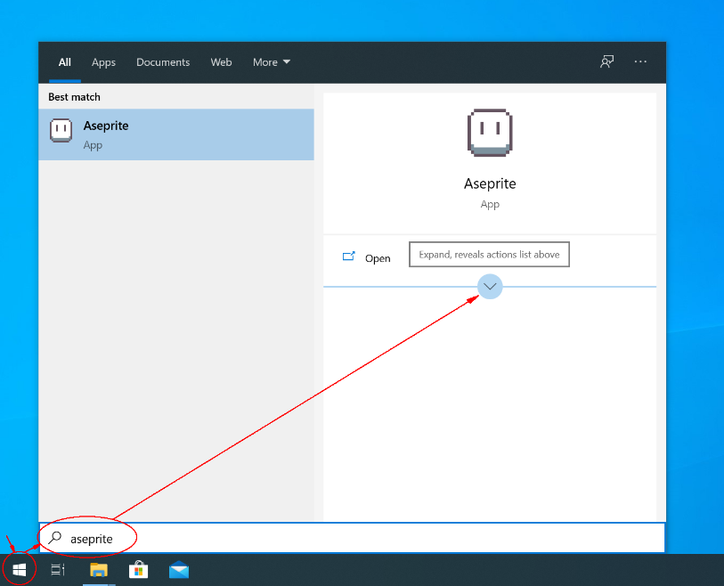
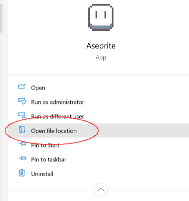
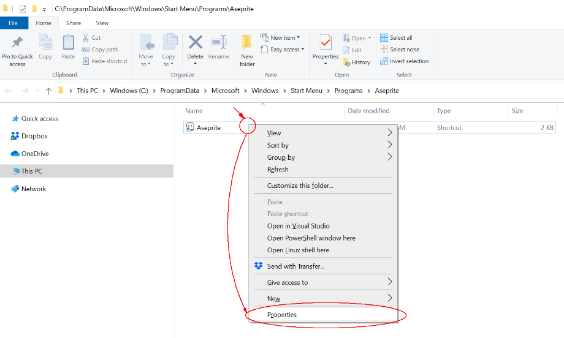
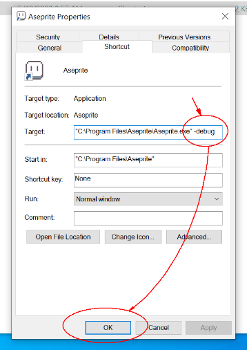
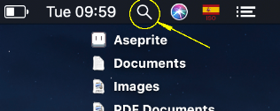
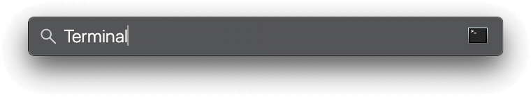
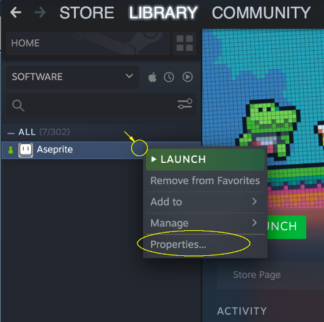
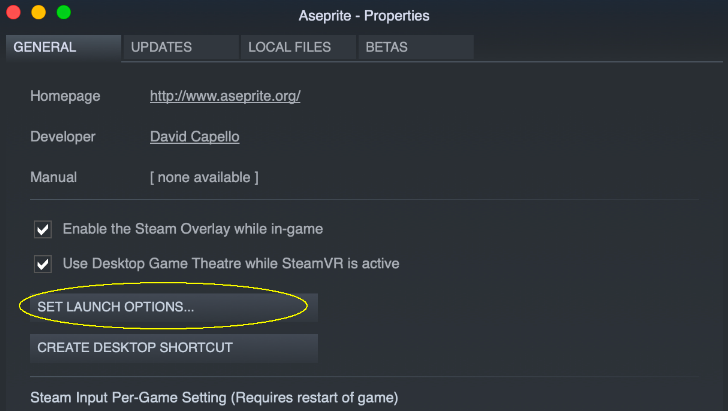
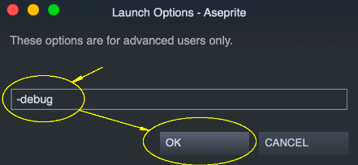

# 调试

如果你在运行 Aseprite 时遇到问题，可以在命令行中使用 `-debug` 选项来执行它。

运行 Aseprite 后，你会看到桌面上会创建一个 `Aseprite-v1.2-DebugOutput.txt` 文件（或类似名称的文件）。你可以将该文件发送至 [support@aseprite.org](mailto:support@aseprite.org)，以便我们帮助你解决具体问题。

如何在以下平台添加 `-debug` 参数：

- [调试](#调试)
  - [Windows](#windows)
  - [macOS](#macos)
  - [Steam](#steam)

<hr>

## Windows

1. 你可以按下 Windows 键打开开始菜单，输入 
   `Aseprite`，然后展开 Aseprite 的操作：

   

2. 在操作列表中点击“打开文件位置”：

   

3. 右键单击 Aseprite 快捷方式，然后选择“属性”选项：

   

4. 最后在“目标”框中输入 `-debug` 参数，然后点击“确定”：

   

<hr>

## macOS

1. 首先你需要关闭 Aseprite，然后按下 ⌘Space 键或点击菜单栏中的放大镜图标来打开聚焦搜索：

   

2. 在聚焦搜索中输入 `Terminal`，然后按下回车键以打开终端应用：

   

3. 在终端中输入以下命令，然后按回车键：

```shell
    open -a Aseprite --args -debug
```

<hr>

## Steam

在 Steam 中，你可以在 Aseprite 的启动选项中添加 `-debug` 选项：

1. 在 Steam 库中右键单击 Aseprite（在 macOS 上使用 Ctrl+单击），然后打开其“属性”：

   

2. 点击“设置启动选项”按钮：

   

3. 添加 `-debug` 选项并点击“确定”：

   

---

**参阅**

[故障排除](troubleshooting.md)
