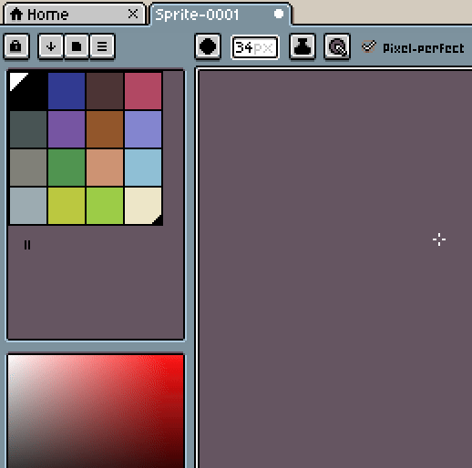

# 默认调色板

新建的精灵会使用默认调色板。这个默认调色板最初是[理查德·“DawnBringer”·费格（Richard "DawnBringer" Fhager）的32色调色板](http://pixeljoint.com/forum/forum_posts.asp?TID=16247)。

无论如何，你都可以使用 ☰ *> 另存调色板为默认值* 菜单选项来更改它：

---

**参阅**

[新建精灵](new-sprite.md)
