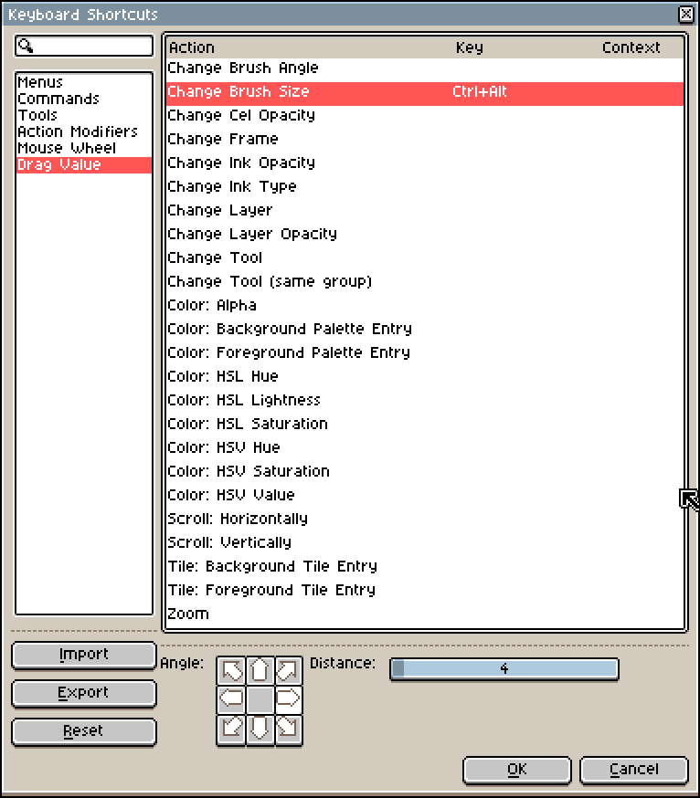
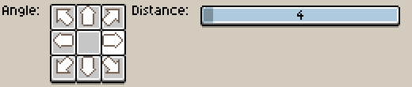

# 拖动值

自 **v1.3-beta12** 起，在 *编辑 > 键盘快捷键 > 拖动值* 中，
你可以配置一个按键，按下该键后沿特定方向（例如左/右或上/下）移动/拖动鼠标，
即可更改 Aseprite 内的特定值/参数，直至松开该按键。

默认情况下，<kbd>Ctrl+Alt</kbd> 被配置为通过左右移动鼠标来增大/减小画笔大小：

底部的控件指示了增量的方向（向右），以及鼠标为使数值增加一个单位（在本例中为画笔大小增加一个单位）必须移动的像素距离（4 像素）。

---

**参阅**

[鼠标滚轮](mouse-wheel.md) |
[键盘快捷键](keyboard-shortcuts.md) |
[问题 #3195](https://github.com/aseprite/aseprite/issues/3195)
