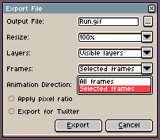
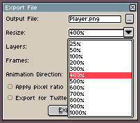
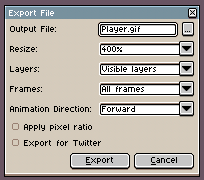

# 导出

通常，你会使用 *文件 > 保存* 以 [保存你的作品](save.md)，该操作会保存完整的信息，
并 [保存为 `.aseprite` 文件](files.md#aseprite)。然后，你可以使用 *文件 > 导出 > 另存为* 
菜单选项（快捷键 <kbd>Ctrl</kbd> + <kbd>Alt</kbd> + <kbd>Shift</kbd> + <kbd>S</kbd>，macOS 系统为 <kbd>⌥</kbd> + <kbd>⇧</kbd> + <kbd>⌘</kbd> + <kbd>S</kbd>）将你的精灵导出，
用于你自己的游戏、网站、应用程序等。这样可以将精灵转换为 `.gif` 文件或一系列 `.png` 文件。

*文件 > 导出 > 另存为* 会记住你最近使用过的选项，以便你再次保存副本。

## 导出为图像序列

你可以通过指定一个包含编号和静态图像文件类型的文件名，将整个动画保存为序列。例如 `frame1.png`，其中 `1` 表示第一帧的编号，`.png` 是用于保存每一帧的静态文件类型。请查看如何[加载图像序列](open.md#loading-image-sequences)。

如果你指定其他文件名，例如 `frame001.png`，那么生成的文件名将会是
`frame001.png`、`frame002.png`、`frame003.png` 等。

## 仅导出一帧

从 *文件 > 导出* 中，你可以导出一帧（或一个图层，或一组选定的帧等），只需将 *帧* 字段更改为 *选定的帧*：

## 导出时自动调整尺寸

*文件 > 导出* 对话框中包含一个特殊的 *调整尺寸* 字段，你可以使用该字段以其他缩放比例保存副本。例如，当你需要将动画上传到社交网络（如 Twitter）时，这个功能就很有用，因为这些平台可能需要更高的缩放比例（例如原始精灵尺寸的 400%）：

## 其他导出选项

*文件 > 导出* 中还有其他实用选项：

* *动画方向*: 你可以以正向、反向或往复模式导出动画。
* *应用像素比例*: 如果你的精灵具有特殊的像素宽高比（例如 2:1），勾选此选项将在导出精灵时将像素宽高比应用到最终结果中。
* *为 Twitter 导出*: 调整动画以避免 Twitter 在重现最后一帧时出现无效延迟的问题。

---

**参阅**

[保存](save.md) |
[精灵表](sprite-sheet.md) |
[命令行界面](cli.md)
