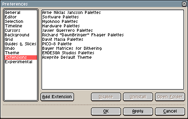

# 扩展

自 **[Aseprite v1.2-beta10](https://www.aseprite.org/release-notes/#aseprite-v1-2-beta10)** 起，
你可以向 Aseprite 添加或从中移除扩展。扩展以 `.aseprite-extension`（`.zip`）文件的形式分发，
你可以在 *编辑 > 首选项 > 扩展* 中管理它们：

## 添加/移除扩展

在 *编辑 > 首选项 > 扩展* 中，有一个“添加扩展”按钮。你可以使用它来选择 `.aseprite-extension` 或 `.zip` 文件。安装扩展后，它将被解压到你的 [配置目录](preferences-folder.md) 下的 `extensions` 子文件夹中。

## 文件内容

扩展/插件实际上与 `.zip` 文件相同，但你可以将文件扩展名重命名为 `.aseprite-extension`，这样用户就可以在 Windows 资源管理器或 macOS 访达中双击它。

`.zip` 文件的内容会根据你想创建的扩展类型而有所不同，但至少它们必须包含一个文件：`package.json` 文件。

The structure of a `.aseprite-extension` file depends on the kind of extension:

* [快捷键](extensions/keys.md)
* [调色板](extensions/palettes.md)
* [语言](extensions/languages.md)
* [主题](extensions/themes.md)
* [抖动矩阵](extensions/dithering-matrices.md)
* [带脚本的插件](https://github.com/aseprite/api/blob/master/api/plugin.md#plugin)
