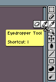
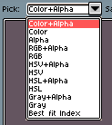
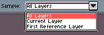

# 吸管工具

吸管工具 
可用于从图像本身选取颜色。可以通过将鼠标移动到工具栏中的橡皮擦图标上来激活该工具：

另外，你也可以通过按下 `I` 键或 `Alt+点击` 来激活该工具。
使用 `左键点击` 可以选取颜色并将其存储为
[前景色](color-bar.md#前景色)，使用
`右键点击` 则会将其存储为
[背景色](color-bar.md#背景色)。

在 [上下文栏](context-bar.md) 中还有一些额外选项：

* 选择 HSV 或 HSL 值而非 RGB 值的选项：

  

* 从 *所有图层*（图层的合成效果）、仅 *当前图层*（不考虑图层混合模式，不进行合成）或 *第一个参考图层*（从找到的第一个参考图层）中选取颜色。

  

## 使用右键选取颜色

你可以在 [编辑 > 首选项 > 编辑器](right-click.md) 中配置 `右键点击` 来选取颜色。

---

**参阅**

[颜色栏](color-bar.md) |
[右键点击](right-click.md)
