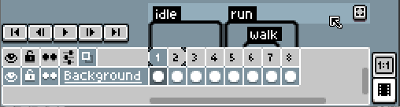
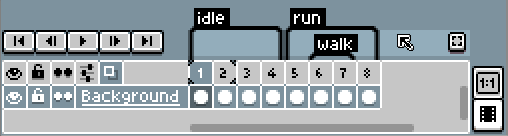

# 聚焦标签

[时间轴](timeline.md) 可以聚焦
[标签](tags.md)，实际上是一个 *“标签带”*。我们将 *“标签带”* 定义为多个标签分组所在的这些行：

你可以双击这些标签带中的某一个，或者点击右侧的小按钮，来 “聚焦” 此标签带中的标签（并隐藏其他所有标签）：

当你这样做时，播放按钮 
将仅播放当前聚焦标签带中的标签。

---

**参阅**

[标签](tags.md) |
[时间轴](timeline.md) |
[动画](animation.md)
