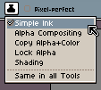

# 墨水

墨水会修改[活动工具](tool-bar.md)的绘制方式。默认的墨水是*简单墨水*。

## 简单墨水

它的行为方式如下：

1. 如果[前景色](color-bar.md#foreground-color)为不透明色
   (alpha = 255 = 100%)，则使用指定的不透明颜色进行绘制。
1. 如果颜色带有透明度 (0 < alpha < 255)，则将该颜色与图层表面进行混合。
1. 如果颜色为透明色 (alpha = 0，遮罩颜色)，则该工具的行为类似于橡皮擦。

## Alpha 混合

它会根据[前景色](color-bar.md#前景色)的透明度值，将前景色与图层表面进行混合：

1. 如果 alpha = 255 = 100%，前景色将完全不透明。
1. 如果 alpha = 128 = 50%，前景色将与图层表面颜色以 50% 的比例混合。
1. 如果 alpha = 0 = 0%，绘制操作将不会产生任何效果，因为颜色完全透明。

## 复制 Alpha+颜色

它会用当前活动的前景色及其透明度值替换图层表面的像素。它不会进行任何形式的透明度合成，只是将当前活动颜色原样复制到目标像素中。

例如，在这种情况下，如果透明度值 alpha = 128 = 50%，最终颜色将与透明度为 128 的前景色相同，而忽略图层表面的颜色。

## 锁定 Alpha

在这种情况下，图层表面的原始 alpha 值将被保留，仅用前景色替换 RGB 颜色分量。

## 遮光模式

有关这种用于像素画的特殊墨水的更多信息，请参阅[遮光模式](shading.md)。

---

**参阅**

[绘制](drawing.md) |
[遮光模式](shading.md)
