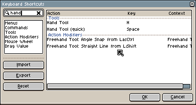

# 键盘快捷键

你可以通过 *编辑 > [键盘快捷键](keyboard-shortcuts.md)* 
菜单选项或 <kbd>Ctrl+Alt+Shift+K</kbd> 键（在 macOS 上为 <kbd>⌥⇧⌘K</kbd>）来自定义键盘快捷键，或自定义按键 + 
[鼠标滚轮](mouse-wheel.md)（或 [鼠标移动](drag-value.md)）的组合。

在 [快速参考](/quickref/) 页面中提供了默认键盘快捷键的总体概述。

## 菜单与命令

在这些部分中，你将找到为 Aseprite 中每个可从 [菜单栏](menu-bar.md) 访问的操作/命令分配按键的方法，以及为不属于主菜单但仍可供高级用户使用的其他命令分配按键的方法（例如，“设置墨水类型” 不与任何菜单关联，也没有默认的键盘快捷键，但你可以从 “命令” 部分分配一个按键）。

请记得使用此对话框中的搜索字段来过滤和查找特定命令。

## 工具

在 “工具” 部分，你可以查看和修改与 [工具栏](tool-bar.md) 中每个工具关联的按键。主要有两点需要考虑：

1. 两个或多个工具可以共享同一个按键。在这种情况下，多次按下该按键会在所有分配了相同按键的工具之间切换。例如，默认情况下，<kbd>U</kbd> 键分配给了  矩形工具和  填充矩形工具，因此按一次会选择矩形工具，按第二次会切换到填充矩形工具。
2. 选择工具的方式有两种：
   * 更改活动工具的常规方式：按下某个按键后，活动工具会发生改变，后续所有鼠标操作都将与该工具进行交互。
     例如，按下 <kbd>P</kbd> 键会切换到  铅笔工具，按下 <kbd>H</kbd> 键会将  抓手工具设为活动工具，这样你就可以在不按下其他任何按键的情况下，通过按住鼠标左键并移动鼠标来平移 [精灵编辑器](sprite-editor.md)。
   * 另一种快速方式（在 *键盘快捷键* 对话框中标记为 “(快速)”）
     在这种方式下，按住按键时工具处于激活状态（松开按键后，Aseprite
     会恢复到之前选择的工具）。
     例如，按住 <kbd>Alt</kbd> 键可临时选择  吸管工具，
     按住 <kbd>空格键</kbd> 可临时选择  抓手工具。
     以下是  抓手工具在配置中的示例：

     

## 动作修改器

这些操作依赖于 Aseprite 中的特定上下文，例如
当你使用选择工具时，或者你正在缩放选区时，等等。
给出的按键为默认选项。

以下是各种上下文及其在该上下文中可能执行的操作列表：

* **自由绘制工具**：当  铅笔工具处于活动状态时。
  * **从最后绘制点绘制直线**：使用 <kbd>Shift</kbd> 键
    从画笔最后绘制的像素点开始绘制一条直线。
  * **从最后绘制点进行角度对齐**：按下 <kbd>Ctrl</kbd> 键
    可对齐该直线的角度。

* **移动工具**：当你使用  移动工具时。
  * **自动选择图层**：按下 <kbd>Ctrl</kbd> 键（在 macOS 上为 <kbd>⌘</kbd>）
    单击鼠标即可选择光标上方的图层。
* **形状工具**：在使用矩形或椭圆形工具（例如  矩形、
   椭圆、
   矩形选框等）绘制时（按下鼠标按钮后且释放前），可以使用这些按键。
  * **正方形/正圆形**：你可以使用 <kbd>Shift</kbd> 键来创建正方形或圆形。
  * **从中心绘制**：你可以在按下 <kbd>Ctrl</kbd> 键时，将鼠标按下的点作为形状的中心，例如指定中心来创建椭圆（而非指定两个角）。
    按下 <kbd>Ctrl</kbd> 键时，以鼠标按下的点作为形状的中心，例如指定中心来创建椭圆（而非指定两个角）。
  * **旋转形状**：按下 <kbd>Alt</kbd> 键可开始旋转形状。
  * **移动原点**：你可以按下 <kbd>空格键</kbd> 在释放鼠标按钮之前将整个形状移动到新位置，以防原点指定不正确。
* **选择**：当我们使用任意选框工具时，可以使用一些按键来更改对所选区域的操作。
  * **添加/减去/相交选区**：这些选项
    在 [选择](selecting.md#添加减去相交) 部分有详细说明。
* **移动选区**：当你正在移动选区时。
  * **对齐网格**：按下 <kbd>Alt</kbd> 键，选区将对齐到网格。
  * **锁定轴**：你可以使用 <kbd>Shift</kbd> 键仅锁定 X 轴或 Y 轴的移动。
  * **复制选区**：在开始移动选区 *之前* 按下 <kbd>Ctrl</kbd> 键，即可复制选区。
  * **精细平移**：当你移动选区时，按下 <kbd>Ctrl</kbd> 键将开始精细调整移动（不仅可以逐像素移动，还可以进行亚像素移动）。
* **缩放选区**：当你正在缩放选区时。
  * **保持纵横比**：按下 <kbd>Shift</kbd> 键可保持宽度和高度之间的比例不变。
  * **从中心缩放**：使用 <kbd>Alt</kbd> 键从中心（或当前枢轴位置）进行缩放。
  * **精细缩放**：当你正在缩放选区时，按下 <kbd>Ctrl</kbd> 键将开始精细调整缩放（不仅可以逐像素缩放，还可以进行亚像素缩放）。
* **旋转选区**：当你正在旋转选区时。
  * **角度对齐**：你可以使用 <kbd>Shift</kbd> 键将角度对齐到 26.6°、45°、90° 等。

* **触发鼠标左键/右键**：你可以配置一个特定的
  按键，以在 [精灵编辑器](sprite-editor.md) 内模拟鼠标左键/右键。

## 键盘 + 鼠标

你可以配置为在按下某个按键并转动鼠标滚轮时（或鼠标沿特定轴移动时）触发一些特殊操作：

* [鼠标滚轮](mouse-wheel.md)
* [拖动值](drag-value.md)

---

**参阅**

[首选项](preferences.md) |
[自定义](customization.md)
