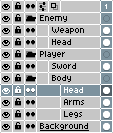

# 图层组

为了更好地组织你的精灵，你可以将一组图层放在一个小文件夹中：

使用图层组，你可以同时显示/隐藏（<kbd>Shift+X</kbd>）或锁定/解锁多个图层，也可以在[时间轴](timeline.md)中展开/折叠文件夹（<kbd>Shift+E</kbd>）

要创建一个新的*图层组*，你可以使用*图层 > 新建 > 新建组*菜单，或按下快捷键 <kbd>Alt+Shift+N</kbd>。如果[时间轴](timeline.md)中有[选定的图层范围](range.md)，则会自动创建包含这些选定图层的新组。

---

**参阅**

[图层](layers.md) |
[时间轴](timeline.md)
