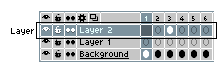
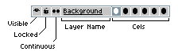

# 图层

一个精灵可以细分为多个图层。你可以在[时间轴](timeline.md)中查看它们：

每个图层都有多个选项：

*图层名称*: 用于标识此图层的文本。你可以通过双击图层，或从 *图层 > 属性* 菜单（<kbd>Shift</kbd> + <kbd>P</kbd> 键）更改图层名称。

*单元格*: 一组 [单元格](cel.md)，即包含特定帧中此特定图层可见内容的帧。

*可见性*: 代表图层是可见的 
还是隐藏的 。你可以使用 *图层 > 可见* 菜单或 <kbd>Shift</kbd> + <kbd>X</kbd> 键切换图层的可见性。

*锁定*: 如果图层已锁定 ，则无法在其上绘制。
默认情况下，所有图层均为未锁定/可编辑状态 。

*连续*: 此选项用于指定为此特定图层创建 [单元格](cel.md) 时你倾向的类型。有关更多信息，请参阅 [连续图层](continuous-layers.md) 部分。

### 常见操作

* [添加新图层](new-layer.md)
* [移动图层](move-layers.md)
* [复制图层](copy-layers.md)

## 背景图层

背景图层是一个不透明的图层（没有 Alpha 通道/透明组件），且无法移动。当你在 *文件 > 新建* 窗口中选择不透明颜色时，或者打开一个不包含 Alpha 通道的文件（例如 `.png` 文件）时，会默认创建背景图层。

一个精灵只能包含一个背景图层，并且它总是位于[时间轴](timeline.md)中图层堆栈的最底部。

当你选择背景图层的一部分并清除它（使用 *编辑 > 清除* 菜单）时，所选区域将用活动的 [背景颜色](color-bar.md) 清除。

## 透明图层

所有带有 Alpha 通道的图层都称为透明图层。
你可以在同一个精灵中拥有多个透明图层。
你可以使用[时间轴](timeline.md)按自己的需求堆叠这些图层。
并且你可以使用[移动工具](move-tool.md) 移动这些图层。

当你选择透明图层的一部分并清除它（使用 *编辑 > 清除* 菜单）时，所选区域将被清除为 [透明颜色](transparent-color.md)。

你可以使用 *图层 > 新建 > 新建图层* 菜单或按 <kbd>Shift</kbd> + <kbd>N</kbd> 来创建一个新的透明图层。

## 从图层转换为背景

如果没有背景图层，你可以使用 *图层 > 转换为 > 背景* 菜单将任意透明图层转换为背景图层。所有透明像素都将填充为活动的 [背景颜色](color-bar.md#background-color)。

> 在之前的 Aseprite v1.2 中，该选项为 *图层 > 从图层创建背景*

## 从背景转换为图层

如果你想将背景图层转换为透明图层（例如，你想使用[移动工具](move-tool.md)  移动它），可以使用 *图层 > 转换为 > 图层* 菜单。

> 在之前的 Aseprite v1.2 中，该选项为 *图层 > 从图层创建背景*

## 图层组

你可以 [分组图层](layer-group.md) 来处理一组图层作为一个单元。

## 瓦片图层

自 **Aseprite v1.3** 起，你可以通过 *图层 > 新建 > 新建瓦片地图图层* 菜单或使用 <kbd>N</kbd> + <kbd>Space</kbd> 组合键来创建 [瓦片地图图层](tilemap.md)。
你还可以从任意常规透明图层使用 *图层 > 转换为 > 瓦片地图* 选项（瓦片将根据活动网格设置创建）。

## 从选择创建新图层

* <kbd>Ctrl</kbd> + <kbd>J</kbd> 或 <kbd>⌘</kbd> + <kbd>J</kbd>: 复制[选框](selecting.md)并从中创建一个新图层
* <kbd>Ctrl</kbd> + <kbd>Shift</kbd> + <kbd>J</kbd> 或 <kbd>⇧</kbd> + <kbd>⌘</kbd> + <kbd>J</kbd>: 剪切[选框](selecting.md)并从中创建一个新图层

---

**参阅**

[时间轴](timeline.md) |
[连续图层](continuous-layers.md) |
[移动工具](move-tool.md)
