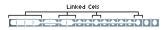
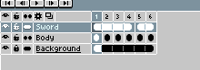

# 链接单元格

当两个单元格共享它们的图像和 *xy* 坐标时，它们就被链接起来了。
链接的单元格在[时间轴](timeline.md)中显示如下：

当你修改这些单元格中的一个时，所有链接的单元格都会被修改。通过这种方式，你可以将相同的更改传播到多个帧中。例如，如果你有一个静态背景，你会希望使用链接的单元格，这样你只需修改一个单元格，就能在整个动画中看到更改。

要创建链接的单元格，你必须在[连续图层](continuous-layers.md)（即带有连续图标  的图层）中[复制单元格](copy-cels.md)。

## 断开链接单元格

有一种方法可以断开链接单元格，在时间轴中右键单击并选择 *断开链接* 选项：

断开链接的单元格将包含其自身的图像副本。因此，现在如果你修改这些单元格，更改将不会传播到其他单元格。

---

**参阅**

[连续图层](continuous-layers.md)
