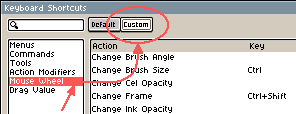

# 鼠标滚轮

默认的鼠标滚轮行为取决于 [*编辑 > 首选项 > 编辑器 > 使用滚轮缩放*](preferences.md#editor) 选项。
部分行为将在不久的将来发生变化：[Issue #2896](https://github.com/aseprite/aseprite/issues/2896)

作为参考，且仅在本节中，以下符号具有给定的含义：

<kbd>⬆</kbd>: 鼠标滚轮向上滚动  
<kbd>⬇</kbd>: 鼠标滚轮向下滚动

## 使用 *使用滚轮缩放*

| 动作              | Windows            | macOS              |
|-------------------|--------------------|--------------------|
| 水平向左滚动      | <kbd>Shift+⬆</kbd> | <kbd>Shift+⬇</kbd> |
| 水平向右滚动      | <kbd>Shift+⬇</kbd> | <kbd>Shift+⬆</kbd> |
| 放大              | <kbd>⬆</kbd>       | <kbd>⬇</kbd>       |
| 缩小              | <kbd>⬇</kbd>       | <kbd>⬆</kbd>       |
| 增大笔刷大小      | <kbd>Ctrl+⬇</kbd>  | <kbd>Ctrl+⬆</kbd>  |
| 减小笔刷大小      | <kbd>Ctrl+⬆</kbd>  | <kbd>Ctrl+⬇</kbd>  |

## 不使用 *使用滚轮缩放*

| 动作              | Windows            | macOS              |
|-------------------|--------------------|--------------------|
| 向上滚动          | <kbd>⬆</kbd>       | <kbd>⬇</kbd>       |
| 向下滚动          | <kbd>⬇</kbd>       | <kbd>⬆</kbd>       |
| 水平向左滚动      | <kbd>Shift+⬆</kbd> | <kbd>Shift+⬇</kbd> |
| 水平向右滚动      | <kbd>Shift+⬇</kbd> | <kbd>Shift+⬆</kbd> |
| 放大              | <kbd>Ctrl+⬆</kbd>  | <kbd>Ctrl+⬇</kbd>  |
| 缩小              | <kbd>Ctrl+⬇</kbd>  | <kbd>Ctrl+⬆</kbd>  |

## 自定义

从 *编辑 > 键盘快捷键 > 鼠标滚轮* 中，你可以
配置按下额外按键时的鼠标滚轮行为：

---

**参阅**

[拖动值](drag-value.md) |
[键盘快捷键](keyboard-shortcuts.md) |
[问题 #2896](https://github.com/aseprite/aseprite/issues/2896)
