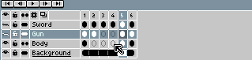

# 移动单元格

使用[时间轴](timeline.md)移动单元格：

1. 选择你想要移动的一系列单元格。
2. 将鼠标悬停在选区边框上方。
3. 从选区边框开始拖动。
4. 将单元格放置到你想要的位置。

请注意，你可以将单元格移动到动画结尾之后。在这种情况下，系统会自动创建新的空白帧。

## 画布位置

你可以使用[移动工具](move-tool.md) 来移动单元格画布的位置（*x* 和 *y* 坐标）。

---

**参阅**

[复制单元格](copy-cels.md) |
[移动帧](move-frames.md) |
[移动工具](move-tool.md) |
[时间轴](timeline.md)
