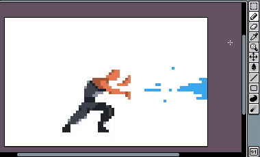

# 移动选框

在对[活动单元格](cel.md)的一部分进行[选框](selecting.md)后，
你可以通过鼠标拖放或使用方向键来移动所选的像素区域：

如果你从[背景图层](layers.md#background-layer)移动一个像素区域，选框将使用活动的[背景颜色](color-bar.md#background-color)清除。如果你移动一个透明图层，该区域将使用透明颜色清除。
