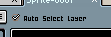
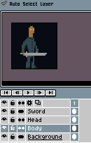
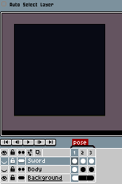

# 移动工具

你可以通过按 <kbd>V</kbd> 键，或使用 <kbd>Ctrl</kbd> 键（在 macOS 上为 <kbd>⌘</kbd> 键）来选择移动工具 。

此工具可用于移动 [单元格](cel.md) 的 *xy* 坐标。

注意：

* 你无法移动背景图层。
* 使用 <kbd>Shift</kbd>（<kbd>⇧</kbd>）键锁定 x 轴或 y 轴。

## 选择并移动图层

当你使用 <kbd>Ctrl</kbd>（或 <kbd>⌘</kbd>）键并 <kbd>左键单击</kbd> 时，移动工具将被选中，且 *自动选择图层* 选项会被勾选：

此选项允许你快速选择并移动图层：

## 移动多个单元格

你可以同时使用时间轴和精灵编辑器来移动多个单元格：

1. 在时间轴中选择多个单元格，然后
2. 在精灵编辑器中移动单元格。

