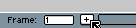

# 新建帧

你可以使用以下方法添加帧：

* *帧 > 新建帧* (<kbd>Alt+N</kbd>)：在当前帧的下一个位置创建该帧的副本。
* *帧 > 新建空白帧* (<kbd>Alt+B</kbd>)：创建一个新的空帧。（所有
   [透明图层](layers.md#) 具有空的像素块，并且 [背景图层](layers.md#背景图层)
   将使用当前活动的背景色清除。）
* *帧 > 复制单元格* (<kbd>Alt+D</kbd>)：复制当前单元格，或
   将当前时间轴选区复制到下一个位置/帧。
* *帧 > 复制链接的单元格* (<kbd>Alt+Shift+D</kbd> 或 <kbd>Alt+M</kbd>)：在
  下一个位置/帧中创建指向当前单元格（或当前时间轴选区）的链接。

状态栏中的小 `+` 号可用于添加新帧（这类似于按下 <kbd>Alt+N</kbd>）：

## 新建帧

使用 *视图 > 新建帧*（<kbd>Alt+N</kbd> 键），你可以创建一个与当前帧完全相同的新帧。对于 [连续图层](continuous-layers.md)，单元格将被 [链接](linked-cels.md)。

## 新建空白帧

使用 <kbd>Alt+B</kbd> 添加新的空白帧时，所有 [透明图层](layers.md#透明图层) 都不会包含像素块，而 [背景图层](layers.md#背景图层) 将使用 [背景色](color-bar.md#background-color) 清除。

当你 [移动](move-cels.md) 或 [复制单元格](copy-cels.md) 操作超出动画末尾时，也会创建空白帧。

## 复制的单元格

部分信息：<https://community.aseprite.org/t/913>
