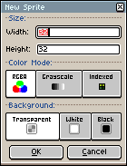
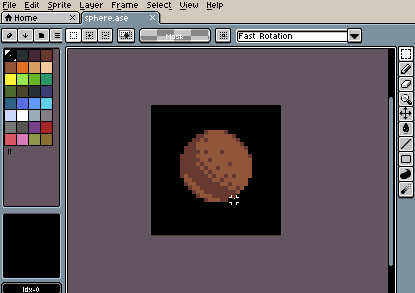

# 新建精灵

你可以通过 *文件 > 新建* 菜单（<kbd>Ctrl+N</kbd> 或 <kbd>⌘N</kbd>）创建新精灵。

在这里你可以选择精灵的以下属性：

* 尺寸（以像素为单位），
* 其[颜色模式](color-mode.md)，以及
* 默认背景颜色。

精灵默认会使用特定的[调色板](default-palette.md)创建。

## 数字字段中的数学运算

像 *宽度* 和 *高度* 这类[数字字段](numeric-field.md)可以计算简单的数学表达式：

## New Sprite from Selection

You can create a new sprite from the active selection using
*Edit > New Sprite from Selection* (<kbd>Ctrl+Alt+N</kbd> or <kbd>⌥⌘N</kbd>):

---

**参阅**

[颜色模式](color-mode.md) |
[默认调色板](default-palette.md)
