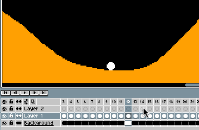
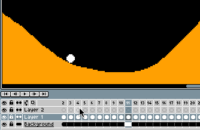

# 洋葱皮

使用 [洋葱皮](https://en.wikipedia.org/wiki/Onion_skinning)，
你可以在 [精灵编辑器](sprite-editor.md) 中同时查看多个帧。
通过这种方式，你可以使用其他帧作为参考来绘制当前帧。
你可以使用 <kbd>F3</kbd> 键，或通过时间轴上的小  图标来启用洋葱皮功能：

你可以指定想要查看的前后帧数，
还能通过
 图标配置其他设置（例如红蓝着色）：

---

**参阅**

[动画](animation.md) |
[时间轴](timeline.md)
