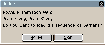

# 打开

你可以使用 *文件 > 打开* 菜单选项加载你的精灵并继续工作。

## 加载图像序列

如果你有一系列图像，比如：

* `frame0.png`
* `frame1.png`
* `frame2.png`
* ...
* `frameN.png`

你可以使用 *文件 > 打开* 菜单将这一序列加载为一个动画，
选择 `frame0.png`，然后在随后出现的对话框中回答 *是*：

---

**参阅**
[保存](save.md) |
[导出](exporting.md)
