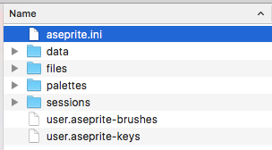
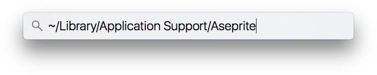

# 首选项文件夹

Aseprite 的配置信息存储在个人用户配置目录下的多个文件中：

你可以通过 *编辑 > 首选项 > 定位配置文件* 选项访问此文件夹。

无论如何，你可以根据不同的平台，通过多种方式手动定位该文件夹：

## 在 Windows 系统上

你可以通过按下 <kbd>Windows 键 + R</kbd> 组合键（或选择 `开始菜单 > 运行...` 选项）来定位首选项文件夹。这将弹出运行程序的对话框。然后输入：

    %AppData%\Aseprite

并按下 `Enter` 键。

## 在 macOS 系统上

你可以通过打开 Spotlight 搜索（<kbd>⌘Space</kbd>）并粘贴以下文本来定位首选项文件夹：
`~/Library/Application Support/Aseprite` 并按下 <kbd>⌘V</kbd> 键。

   

## 在 Linux 系统上

打开终端，粘贴以下命令并按下 <kbd>Enter</kbd> 键：

    xdg-open ~/.config/aseprite

## 特殊配置

自 Aseprite v1.2.16.3 版本起，出于测试目的，你可以使用指向其他文件夹的 `ASEPRITE_USER_FOLDER` [环境变量](https://en.wikipedia.org/wiki/Environment_variable) 来重新配置首选项文件夹的位置。

---

**参阅**

[首选项](preferences.md) |
[重置首选项](reset-preferences.md)
