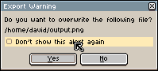

# 首选项

你可以通过 *编辑 > 首选项* 菜单，或按下 <kbd>Ctrl</kbd> + <kbd>K</kbd> 键（在 macOS 上为 <kbd>⌘</kbd> + <kbd>K</kbd> 或 <kbd>⌘</kbd> + <kbd>,</kbd>）来更改 Aseprite 的配置。如果你想配置键盘快捷键，可以通过 *编辑 > [键盘快捷键](keyboard-shortcuts.md)* 菜单选项进行操作。

首选项对话框被分为几个部分：

## 常规

* **屏幕缩放**: 更改 Aseprite 每个窗口内每个像素的大小。默认值为 200%，这意味着窗口中的每个像素将在屏幕上以 2x2 的方块表示。使用大型显示器（例如 4K 显示器）时，你可以尝试将其更改为 300% 或 400%。如果你希望精灵图的每个像素在屏幕上以一个像素的形式显示，你应该将此选项设置为 100%，在这种情况下，你很可能需要根据需要将下一个选项（*UI 元素缩放*）增加到 200% 或更高。
* **UI 元素缩放**: 仅对用户界面元素（按钮、标签等）应用的额外缩放，不会修改精灵编辑器的缩放比例。默认值为 100%。
* **Light** | **Dark** 选项：自 v1.3 版本起，你可以快速在 Aseprite 的浅色主题和深色主题之间切换。
* **语言**：用户界面的语言，默认值为英语，
  但你可以从以下链接获取一些用户贡献的翻译：
  https://github.com/aseprite/languages
* **显示 Aseprite 菜单栏**（仅适用于 macOS）：[Aseprite 菜单栏](menu-bar.md) 在 Windows 和 Linux 上默认可见：

    

  但在 macOS 上默认是隐藏的，因为在 macOS 上你可以使用系统菜单栏：

    

* **鼠标悬停时展开菜单栏项目**：勾选此选项后，当鼠标移动到 [Aseprite 菜单栏](menu-bar.md) 上方时，菜单将自动展开。默认情况下此功能处于禁用状态，因此你需要点击菜单才能打开它。
* **在每个调色板条目之间绘制分隔线**：
* **与 Aseprite 开发者分享崩溃数据**：当 Aseprite 崩溃（意外关闭）时，系统会请求你在未来自动私下与 Aseprite 团队分享一些崩溃信息。Aseprite 默认不会执行此操作（此选项默认未勾选），因此你需要同意分享这些信息。更多详细信息请查看
  [#2857](https://github.com/aseprite/aseprite/issues/2857)

## 警告

在 Aseprite 中，有几个（不可撤销的）操作会显示警告消息，并带有一个 *不再显示此警告* 的复选框：

你可以通过 *编辑 > 首选项 > 警告* 重新启用这些对话框。

## 编辑器

更改 [精灵编辑器](sprite-editor.md) 一般行为的选项：

* **使用鼠标滚轮缩放**：默认已勾选，你可以使用 [鼠标滚轮](mouse-wheel.md) 进行缩放（如果取消勾选，鼠标滚轮的默认操作将变为垂直滚动）。
* **双指上下滑动缩放**：此功能仅适用于 macOS，启用后，你可以在 MacBook 的触控板上使用双指进行缩放。
* **使用鼠标滚轮从中心缩放**：如果你希望在使用鼠标滚轮时从精灵编辑器的中心进行 [缩放](zoom.md)，而不是从鼠标位置进行缩放，请勾选此选项。
* **使用按键从中心缩放**：当你使用 [缩放](zoom.md) 按键 <kbd>1</kbd>、<kbd>2</kbd>、<kbd>3</kbd> 等时，将从精灵的中心而不是鼠标位置进行缩放。
* **在精灵编辑器中显示滚动条**：取消勾选此选项可隐藏所有精灵编辑器中的滚动条。
* **编辑器边缘自动滚动**：勾选此选项后，当你正在[绘制](drawing.md)（按住鼠标按钮）且鼠标触及精灵编辑器边缘时，编辑器将自动滚动。
* **打开精灵时自动适配屏幕**：勾选此选项后，
  在创建新精灵或打开现有精灵图时，编辑器会在画布的可用空间内显示完整图像。
  当此选项未勾选（默认选项）时，初始缩放级别默认将为 100%。
* **铅笔工具立即预览直线**：当你使用  铅笔工具时，按下 <kbd>Shift</kbd> 键将从最后绘制的点开始绘制一条直线。勾选此选项后，按下 <kbd>Shift</kbd> 键后你将立即看到直线预览（无需等待按下鼠标按钮）。如果你觉得这很烦人，可以取消勾选此选项。
* **使用吸管工具时丢弃自定义笔刷**：如果你使用 *编辑 > 新建笔刷* 选项创建了一个自定义笔刷，使用  吸管工具会更改笔刷的颜色。勾选此选项后，使用吸管工具选取颜色后，自定义笔刷将被完全丢弃，并且会选择一个带有所选颜色的常规笔刷。
* **降采样**：当缩放级别 ≤ 50% 时，用于显示精灵的算法。默认值为 *双线性纹理映射*。
* **右键点击**：你可以自定义 [右键点击](right-click.md) 时执行的具体操作。

---

**参阅**

[首选项文件夹](preferences-folder.md) |
[重置首选项](reset-preferences.md) |
[自定义](customization.md)
