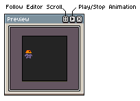

# 预览窗口

预览窗口是可以实时显示动画预览的小窗口：

你可以按 <kbd>F7</kbd> 键或通过 *视图 > 预览* 菜单选项来显示/隐藏这个小窗口。

你也可以点击小播放按钮  或按下 <kbd>Shift+Enter</kbd> 来
开始在窗口中播放精灵动画（或当前的 [标签](tags.md)）。

---

**参阅**

[工作区](workspace.md) |
[绘制](drawing.md) |
[动画](animation.md)
