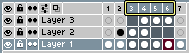
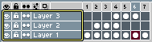
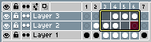

# 选择范围

在 [时间轴](timeline.md) 中，你可以选择一系列帧：

一系列图层：

或者选择一系列的单元格：

选择范围后，你可以对其执行以下几种操作：

* [移动帧](move-frames.md) 或 [标记帧](tags.md)，或
* [更改图层顺序](move-layers.md)，或
* [移动单元格](move-cels.md)。

---

**参阅**
[时间轴](timeline.md)
