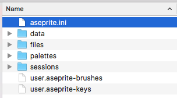
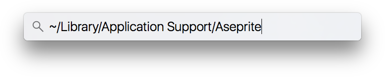

# 重置首选项

Aseprite 的首选项存储在 [配置文件夹](preferences-folder.md) 中的 `aseprite.ini` 文件里。你可以通过 *编辑 >
首选项 > 定位配置文件* 来访问该文件夹。若要重置所有配置，
你可以关闭 Aseprite，然后删除 `aseprite.ini` 所在文件夹中的所有文件：

如果无法启动程序，可按以下步骤在各个平台上手动重置首选项。

## 在 Windows 系统上

1. 关闭 Aseprite
1. 按下 <kbd>Windows 键 + R</kbd> 组合键（或选择 `开始菜单 > 运行...` 选项）来定位首选项文件夹。这将弹出运行程序的对话框。然后输入：

       %AppData%\Aseprite

   并按下 Enter 键。
1. 删除该文件夹中的所有文件（主要是 `aseprite.ini`）
1. 重新启动 Aseprite

## 在 macOS 系统上

1. 关闭 Aseprite
1. 打开 Spotlight 搜索（⌘Space）
1. 粘贴以下文本 `~/Library/Application Support/Aseprite` 并按下 Enter 键：

   

1. 删除该文件夹中的所有文件（主要是 `aseprite.ini`）
1. 重新启动 Aseprite

## 在 Linux 系统上

1. 关闭 Aseprite
1. 打开终端
1. 输入以下命令：

       xdg-open ~/.config/aseprite

1. 删除该文件夹中的所有文件（主要是 `aseprite.ini`）
1. 重新启动 Aseprite

---

**参阅**

[故障排除](troubleshooting.md) |
[首选项](preferences.md) |
[首选项文件夹](preferences-folder.md)
