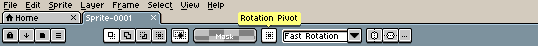
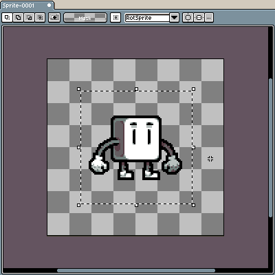
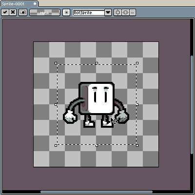
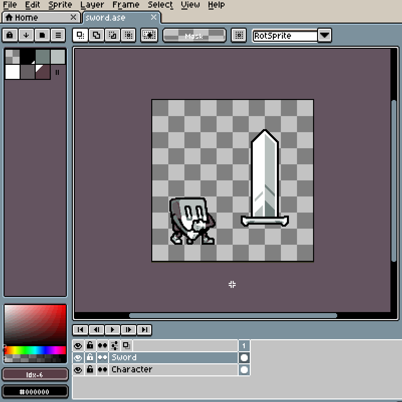
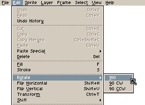
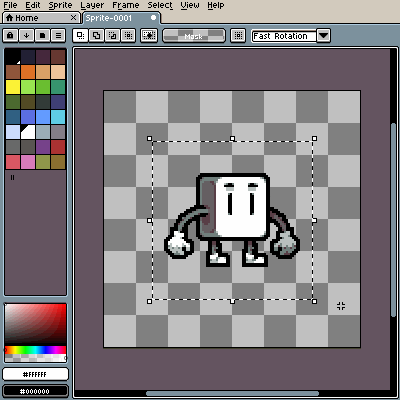
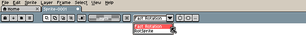
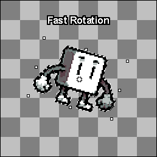

# 旋转精灵或选框

任何选框都可以使用 [控制器](rotate.md#控制器) 或 [菜单选项](rotate.md#菜单选项) 进行旋转，这两种方法都会使用所选的 [算法](rotate.md#旋转算法) 围绕 [旋转中心点](rotate.md#旋转中心点) 旋转选框。

## 旋转中心点

选框会围绕一个指定的点（）进行旋转。默认情况下，旋转中心点位于选框的中心位置，在你开始旋转图像之前它是不可见的。

可以从任何选择工具的上下文栏更改其位置和可见性设置。也可以按住 <kbd>左键</kbd> 并用鼠标拖动该点来移动旋转中心点：

Sprite by <a href="https://twitter.com/ThKasparrr">@ThKasparrr</a>

## 控制器

可以通过将鼠标移动到控制器的外部（），按住 <kbd>左键</kbd> 并在画布上拖动鼠标来旋转选框：

鼠标光标会发生变化，以指示拖动控制器是会调整选区大小还是旋转选区：

|        |                   调整大小                   |                   旋转                   |
| ------ | :----------------------------------------: | :----------------------------------------: |
| 光标   |  |  |

按住 <kbd>Shift</kbd> 键可以对齐特定角度（0º、45º、90º 等）。

## 菜单选项

可以使用 _编辑 > 旋转_ 下的菜单选项将选区旋转 90º 或 180º。

## 旋转算法

有两种可用的旋转算法：

- 快速旋转
- [旋转单位（RotSprite）](https://en.wikipedia.org/wiki/Pixel-art_scaling_algorithms#RotSprite)

虽然旋转单位（RotSprite）被广泛认为是一种能产生更好效果的算法，但最终选择还是取决于你的偏好。

---

**参阅**

[翻转](flip.md) |
[调整尺寸](resize.md) |
[移动选框](move-selection.md)
