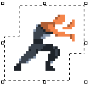
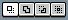
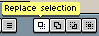
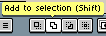
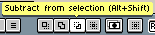
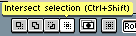

# 选择

你可以使用其中一种选框工具来选择精灵的部分区域，
例如选框工具 （<kbd>M</kbd> 键），
然后[移动所选区域](move-selection.md)或[变换所选区域](transformations.md)
（[缩放](resize.md)、[旋转](rotate.md)等）。当你选择精灵的一部分时，会看到
[蚂蚁线](https://en.wikipedia.org/wiki/Marching_ants)效果：

当你进行选框时，你选择的是活动的 [单元格](cel.md)，因此所有变换操作都只会应用于该特定单元格。

## 添加/减去/相交

在 [上下文栏](context-bar.md) 中，你可以找到一组修改器，它们可以改变对所选区域的操作方式：

默认情况下，当你按下鼠标左键并拖动，然后释放时，它将替换整个选区。但你可以使用其他选项修改此行为（每个选项都有一个键盘快捷键）：

* : 默认操作，用新选区替换整个选区（拖动鼠标左键）
* : 将现有选区与新选区合并（拖动鼠标左键 + <kbd>Shift</kbd> 键）
* : 从现有选区中减去新选区（拖动鼠标左键 + <kbd>Alt+Shift</kbd> 键，或者：拖动鼠标右键）
* : 将现有选区与新选区相交（拖动鼠标左键 + <kbd>Ctrl+Shift</kbd> 键）

这些快捷键可以在 [*编辑 > 键盘快捷键 > 动作修改器*](keyboard-shortcuts.md#action-modifiers) 中自定义。

## 选框内容

你可以选择：
- 使用 *选择 > 全部* (<kbd>Ctrl</kbd> + <kbd>A</kbd> 或 <kbd>⌘</kbd> + <kbd>A</kbd>) 选择整个精灵画布
- 使用 *编辑 > 变换* (<kbd>Ctrl</kbd> + <kbd>T</kbd> 或 <kbd>⌘</kbd> + <kbd>T</kbd>) 选择活动的 [单元格](cel.md) 边界
- 在图层上使用 <kbd>Ctrl</kbd> + <kbd>左键点击</kbd> 选择活动帧内容（非透明像素）（可以应用添加/减去/相交修改器的快捷键）

## 取消选择和重新选择

你可以使用 *选择 > 取消选择* (<kbd>Ctrl</kbd> + <kbd>D</kbd> 或 <kbd>⌘</kbd> + <kbd>D</kbd>) 隐藏当前选区。然后，你可以使用 *选择 > 重新选择* (<kbd>Ctrl</kbd> + <kbd>Shift</kbd> + <kbd>D</kbd> 或 <kbd>⇧</kbd> + <kbd>⌘</kbd> + <kbd>D</kbd>) 再次显示选区。

## 反选

你可以使用 *选择 > 反选* (<kbd>Ctrl</kbd> + <kbd>Shift</kbd> + <kbd>I</kbd> 或 <kbd>⇧</kbd> + <kbd>⌘</kbd> + <kbd>I</kbd>) 来反转选区。

---

**参阅**

[变换](transformations.md) |
[移动选框](move-selection.md)
