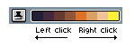
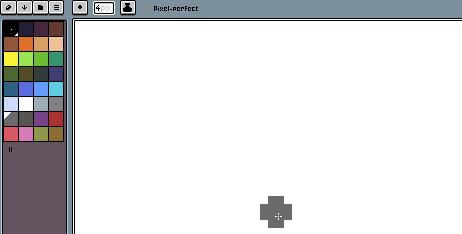
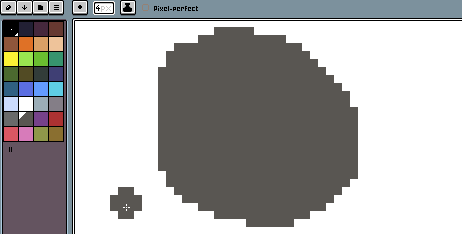
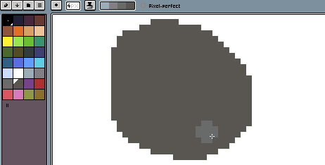
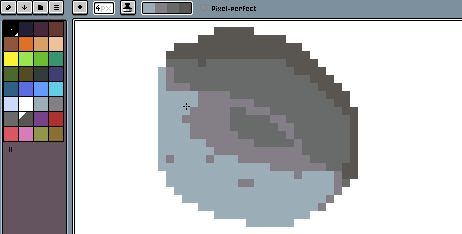

# 遮光模式

遮光模式 [墨水](ink.md) 可用于在我们的精灵中创建阴影。我们可以
使用左键和右键在渐变（由[颜色栏](color-bar.md)中选定的颜色确定）之间移动颜色：

使用此墨水的步骤如下：

首先，我们用一种基础颜色绘制一些内容，以便添加光照或阴影：

然后，我们选择“遮光模式”墨水模式，并从调色板中选择一组颜色，其中包括之前选定的基础颜色。这个
渐变将用于表示阴影和光照：

你可以使用左键将颜色移动到渐变的左侧：

或者，你可以使用右键将颜色移动到右侧：

---

**参阅**

[绘制](drawing.md) |
[墨水](ink.md)
