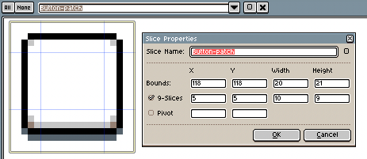

# 切片

使用切片工具 
（<kbd>Shift</kbd> + <kbd>C</kbd> 键），你可以标记精灵图中的区域，并为该区域指定一个名称/标签，还能添加一些用户自定义信息。该工具支持指定
[9切片](https://en.wikipedia.org/wiki/9-slice_scaling)/九宫格信息。

使用此工具，你可以：

1. 按下鼠标按钮，拖动鼠标并释放，标记一个矩形区域来创建新切片。
1. 如果标记的矩形与现有切片重叠，这些切片将被选中。
1. 你可以拖放一组已选中的切片，将它们移动到其他位置。或者，你可以通过拖动角落或边缘来调整整个切片组的大小。
1. 选中一些切片后，你可以按 Delete 键或选择 *编辑 > 删除* 菜单选项来删除它们。
1. 双击一个切片，你将看到 [切片属性](#切片属性) 对话框。

## 切片属性

如果你双击一个切片，你将看到它的属性：



在这里你可以指定：

1. 切片在画布中的边界
1. 九宫格属性，用于指定一个内部矩形，将边界细分为子切片
1. 轴心点，用于指定切片内精灵的中心/基准位置

## 导出切片

你可以使用 [--split-slice 选项](cli.md/#split-slices) 将每个切片导出为不同的精灵图。

你还可以使用 [--data 选项](cli.md/#data)，或者勾选 JSON 输出后选择 *文件 > 导出精灵表* 菜单选项，将切片信息导出为精灵表 JSON 文件。以下是导出数据的示例：

```json
{ ...
 "meta": {
  ...
  "slices": [
   { "name": "Button-patch",
     "color": "#0000ffff",
     "keys": [{ "frame": 0,
                "bounds": {"x": 118, "y": 118, "w": 20, "h": 21 },
                "center": {"x": 5, "y": 5, "w": 10, "h": 9 } }] }
  ]
}
```

---

**参阅**

[绘制](drawing.md)
