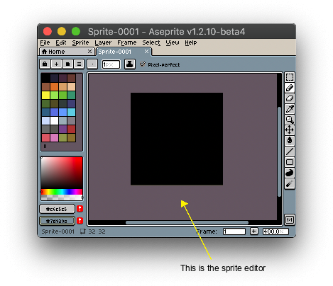

# 精灵编辑器

当你创建一个[新精灵](new-sprite.md)时，精灵编辑器是你首先会看到的界面：

在精灵编辑器中，你可以：

1. 使用鼠标点击、手写笔/触控笔进行[绘制](drawing.md)，或者在 Windows Surface 设备上用单指绘制。
1. 使用鼠标滚轮，或者在 MacBook 触控板、Windows Surface 屏幕上用双指捏合手势进行[缩放](zoom.md)。
1. 你还可以按住 <kbd>Shift</kbd> 键并使用鼠标滚轮滚动/平移视图，或者在 MacBook 触控板、Windows Surface 屏幕上用双指操作。

### 首选项

你可以从 [*编辑 > 首选项 > 编辑器*](preferences.md#editor) 自定义精灵编辑器的行为。

---

**参阅**

[精灵](sprite.md) |
[时间轴](timeline.md) |
[工作区](workspace.md) |
[基础](basics.md)
