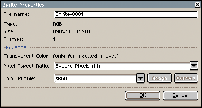

# 精灵属性

你可以从 *精灵 > 属性* 菜单（<kbd>Ctrl+P</kbd> 或 <kbd>⌘P</kbd>）更改一些精灵属性：

你可以：

* 更改 [透明颜色](transparent-color.md)（适用于 [索引颜色模式](color-mode.md#indexed)）
* 更改像素横纵比
* 分配或转换 [颜色配置文件](color-profile.md)

## 颜色配置文件

在 *精灵属性* 对话框中，你有两个按钮：一个用于 **分配** 其他颜色配置文件，另一个用于 **转换** 为其他颜色配置文件：

* 如果你为精灵 **分配** 一个新的颜色配置文件，像素值不会被修改，只是将新的颜色配置文件分配给精灵。你会注意到图片中的颜色会发生变化，因为现在 RGB 值保持不变，但 [颜色配置文件](color-profile.md) 已经改变。例如，现在的 “纯红色” 值 (255, 0, 0) 可能与之前的 “纯红色” 不同。
* 如果你 **转换** 颜色配置文件，像素值将从一个颜色空间转换到另一个颜色空间，因此颜色在视觉上应该不会有差异，但每个 RGB 值都会调整到新的颜色空间（因此几乎所有像素值都会被修改）。

---

**参阅**

[新建精灵](new-sprite.md) |
[颜色配置文件](color-profile.md) |
[透明颜色](transparent-color.md)
