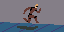
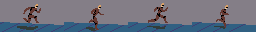
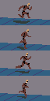
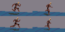
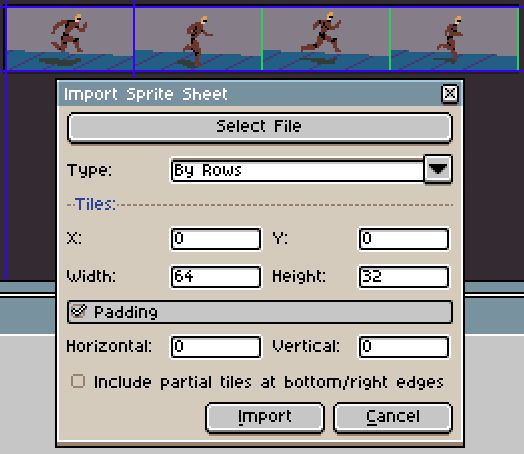
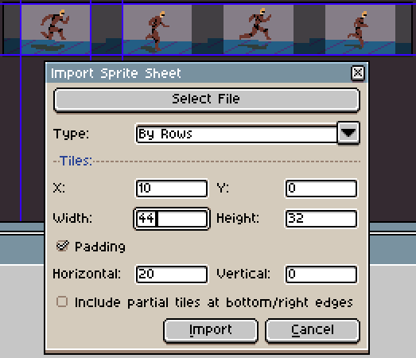
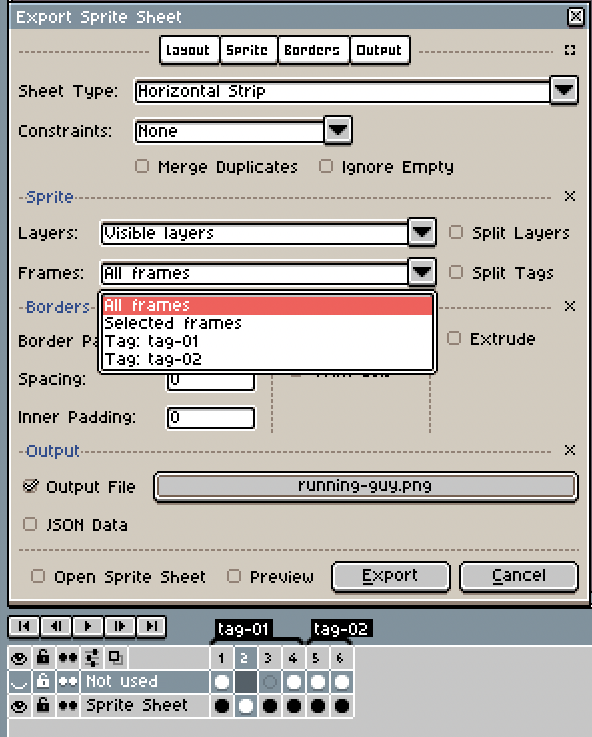

# 精灵表

精灵表是一张包含同一精灵多个帧的大图。例如，你可以保存这样的动画：

例如一张水平精灵表：

一张垂直精灵表：

或者一个矩阵精灵表：

在接下来的章节中，你将了解如何将这类图像导入和导出到 Aseprite 中。

## 导入

要导入精灵表，请使用 *文件 > 导入精灵表* 选项。
然后你可以选择要导入的文件，并指定偏移量 `x`、
`y` 以及精灵的 `宽度`、`高度`。

如果精灵之间存在间隙，可以使用填充功能，
并且精灵表类型会影响所导入精灵的顺序。

## 导出

要导出精灵表，请使用 *文件 > 导出精灵表* 选项。
你可以选择所有可见图层或特定图层，
并根据标签选择帧。

## 命令行自动化

(*开发中*)

## 纹理图集

纹理图集是一张包含游戏所需的所有图形、精灵和图像的大图。它被称为“纹理”是因为该图像可以加载到显存中，以便利用硬件加速在屏幕上渲染图形。
