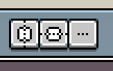
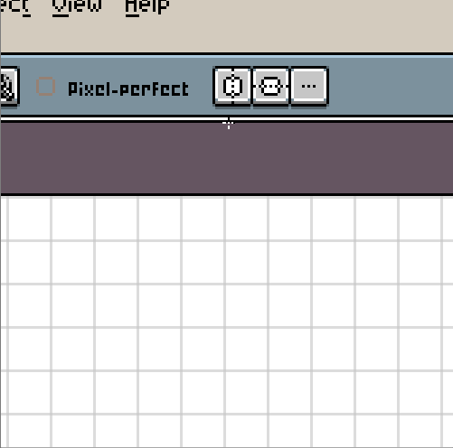
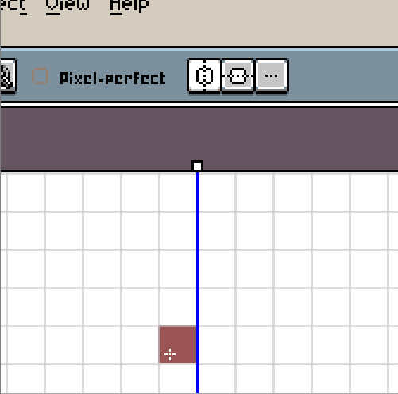
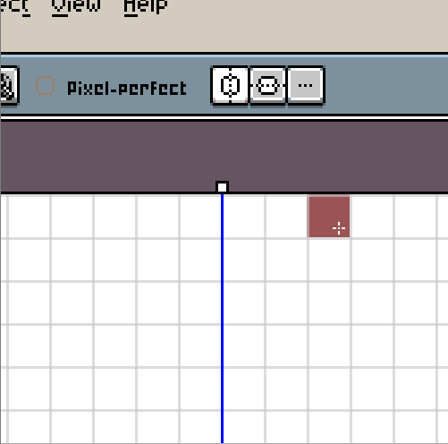

# 对称

要绘制对称的精灵，你可以使用 *视图 > 对称选项* 菜单中的对称选项。这将在 [上下文栏](context-bar.md) 中显示以下按钮：

*  启用水平对称
*  启用垂直对称
*  显示一个弹出菜单，其中包含 *重置对称为中心* 选项

当你启用一个对称轴（例如水平对称/垂直轴）时，你可以拖放屏幕上的控制柄来配置轴的位置：

然后，只需进行绘制，图像的两侧都会被绘制：

你可以将轴放在像素的中间，如果需要的话：

---

**参阅**

[绘制](drawing.md)
