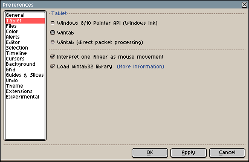

# 平板

## Windows

自 Windows 8 起，微软引入了一个新的 API，用于在 Windows 程序中使用平板：指针 API。自 Aseprite v1.2.19.1 起，你可以配置自己偏好使用的 API：



* *Windows 8/10 指针 API*: 此选项可能适用于大多数现代设备，你可以尝试使用此选项，看看平板的工作效果如何（与 Wintab 相比，此选项可能效果更好）
* *[Wintab](wintab.md)*: 目前，这是在较旧系统（Windows Vista/7）和较旧设备上支持压感的默认选项。
* *Wintab（直接数据包处理）*: 此选项在某些设备上可能效果不佳，
  但在其他设备上可能有助于避免丢包，使笔触更流畅。

点击 *确定*/*应用* 按钮将立即更改平板设置，无需重启程序。

## Linux/X11

在 X11 上，平板/手写笔/钢笔设备似乎是通过设备名称/品牌名称来检测的，而非通过设备功能来检测。

有一些预定义的 ID 可用于检测手写笔，但这可能还不够（如 [#3176](https://github.com/aseprite/aseprite/issues/3176) 所示）

如果 Aseprite 无法检测到你的手写笔的压感，自 **Aseprite v1.2.35** 起，你可以尝试执行以下步骤：

1. 关闭 Aseprite
2. 在终端/控制台中运行 `xinput --list`
3. 查看输出，找出可能与你的手写笔相关的设备（[输出示例](https://github.com/aseprite/aseprite/issues/3176#issuecomment-1111799083)）
4. 打开 [首选项文件夹](preferences-folder.md) 中的 `aseprite.ini` 文件
5. 找到 `[general]` 部分，并在 `x11_stylus_id` 选项中添加你的手写笔名称（名称必须与 `xinput --list` 输出的第一列完全一致）：
```
[general]
x11_stylus_id = Your Stylus Name
```
6. 保存文件并启动 Aseprite

如果此方法对你有效，请在 [#3176](https://github.com/aseprite/aseprite/issues/3176) 中添加一条新评论，并注明你的设备名称。

---

**参阅**

[Wintab](wintab.md) |
[故障排除](troubleshooting.md)
