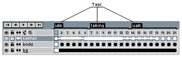
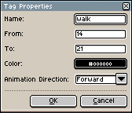

# 标签

标签表示精灵的一段动画。使用多个标签，你可以组织精灵的不同动画：

要创建标签，你可以[选择一个帧范围](range.md)，然后使用 *帧 > 标签 > 新建标签* 菜单选项，或者右键单击该范围并选择 *新建标签*，也可以按两次 *F2* 键。也就是说，第一次按 *F2* 键会创建一个 [*"循环" 标签*](loop.md)，第二次按 <kbd>F2</kbd> 会显示标签属性，这样你就可以更改其名称等：

标签最有趣的属性是 *"动画方向"*，
你可以在此指定三种不同的标签播放模式：
*正向*、*反向* 或 *往复*。

---

**参阅**

[动画](animation.md) |
[精灵](sprite.md)
