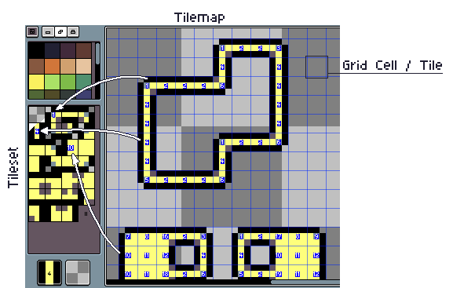

# 瓦片地图

自 **Aseprite v1.3** 起，你可以使用 *瓦片地图* 创建 *图块地图*。

什么是 **瓦片地图**？瓦片地图是一种特殊的图层，画布上的每个网格单元格都是对其 *图块集* 中某个图块（小图像）的引用。你可以通过 *图层 > 新建 > 新建瓦片地图图层* 或按 <kbd>Space</kbd> + <kbd>N</kbd> 来创建一个新的瓦片地图。

什么是 **图块集**？顾名思义，它是一组图块，就像调色板是一组颜色一样。每个图块都有一个索引，并且可以在每个瓦片地图网格单元格的画布中的不同位置重复使用。

示例：

## 与索引颜色的相似之处

我们可以将瓦片地图与[索引图像](color-mode.md#索引)进行比较：

| 瓦片地图 | 索引颜色
| -------- | -------------
| **图块**：一个小图像，可以在瓦片地图图层的多个位置重复使用 | **调色板条目**：一种 RGBA 颜色，可以在索引图像的多个位置重复使用。
| **图块集**：一组大小相同的图块。 | **调色板**：一组 RGBA 颜色（调色板条目）。
| **瓦片地图图层**：一种二维图像，其中每个像素都是一个“图块索引”，该索引引用图块集中的一个图块。每个瓦片地图都关联一个特定的图块集。 | **索引图像**：一种二维图像，其中每个像素都使用一个索引引用一个调色板条目。
| **图块索引**：一个从 0 到 N 的值（其中 N = 图块集中的图块数量，0 表示 *空图块*） | **调色板索引**：一个从 0 到 N-1 的值（其中 N = 调色板条目的数量）

## 模式

当你处于瓦片地图图层时，有两种主要模式，你可以通过按 <kbd>Space</kbd> + <kbd>Tab</kbd> 在这些模式之间切换：

| 模式 |   | 描述
| ---- | - | -----------
| *绘制像素* |  | 在每个图块中绘制像素，即修改图块内容/像素。这类似于修改常规图层（修改像素）。 |
| *绘制图块* |  | 直接放置/获取图块（不修改图块内容，修改瓦片地图信息） |

当我们在瓦片地图中绘制像素时，我们正在修改每个图块的内容，但有三种特殊模式指示我们应该如何处理图块之间的这些修改：

| 绘制像素 |   | 描述
| ------------ | - | -----------
|  | *手动* | 它会修改每个图块的内容，但不会重新排序图块集。如果你已有一个固定的图块集，并且不想更改图块集中每个图块的位置，此模式会很有用。<kbd>Space</kbd> + <kbd>1</kbd>
|  | *自动* | 绘制时，它会尝试创建新图块（或重用现有图块），并且如果在引用该图块集的任何瓦片地图中都找不到未使用的图块，就会将其删除。这是默认模式，因为它会尝试模拟常规图层，自动调整整个图块集。<kbd>Space</kbd> + <kbd>2</kbd>
|  | *堆叠* | 它会为现有图块的每次修改创建一个新图块，不会修改现有图块，而是将所有新图块堆叠起来。<kbd>Space</kbd> + <kbd>3</kbd>

---

**参阅**

[颜色模式](color-mode.md) |
[图层](layers.md)
