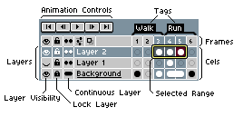
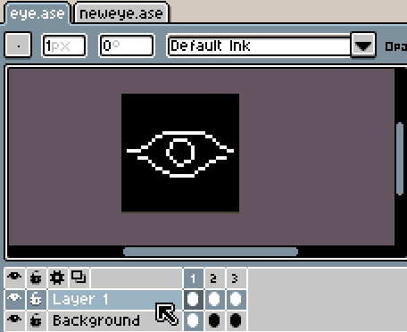

# 时间轴

这是时间轴：

它显示了当前活动精灵的[图层](layers.md)和帧。你可以使用*视图 > 时间轴*菜单选项，或按下 <kbd>Tab</kbd> 键来显示或隐藏它。当你创建一个[新帧](new-frame.md)或[新图层](new-layer.md)时，它也会自动出现。（可通过*编辑 > 首选项 > 时间轴 > 自动显示时间轴*来禁用此行为。）

你可以使用*图层 > 新建图层*菜单（<kbd>Shift</kbd> + <kbd>N</kbd>）来创建新图层，
或使用*帧 > 新建帧*菜单（<kbd>Alt</kbd> + <kbd>N</kbd>）来添加帧。

### 常见操作

* [图层](layers.md):
  * [移动图层](move-layers.md)
  * [复制图层](copy-layers.md)
* [帧](animation.md):
  * [移动帧](move-frames.md)
  * [复制帧](copy-frames.md)
* [单元格](cel.md):
  * [移动单元格](move-cels.md)
  * [复制单元格](copy-cels.md)
* [标签](tags.md):
  * [循环区间](loop.md)
  * [聚焦标签](focus-tag.md)

## 首选项

你可以通过按下  按钮来配置时间轴。

一些选项：

1. [洋葱皮](onion-skinning.md)
1. [将第一帧编号设为 0](https://community.aseprite.org/t/3895/2)（或其他数字）

## 在文档间复制

你可以使用 *编辑 > 复制* 和 *编辑 > 粘贴* 在不同文档之间复制和粘贴图层、帧或单元格。

---

**参阅**

[动画](animation.md) |
[洋葱皮](onion-skinning.md) |
[图层](layers.md) |
[单元格](cel.md) |
[标签](tags.md)
